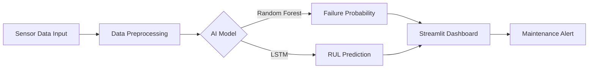

# Predictive-Maintenance-Capstone
AI-Powered Predictive Maintenance System
# AI-Powered Predictive Maintenance System 🏭

### 🏆 Capstone Project | Team Exceptional (Group 1)
**Course:** ITAI 2272  
**Authors:** Miguel Mora, Richard Evans, Akinbobola Akinpelu, Jade Sanchez, Olugbenga Adegoroye

---

## 📖 Project Showcase
Unplanned equipment failures cost industrial businesses billions in downtime and repairs. Our solution uses Artificial Intelligence to predict when machines will fail *before* it happens.

**The Goal:**
To build a Predictive Maintenance System that analyzes sensor data from turbofan engines to forecast **Remaining Useful Life (RUL)** and provide early warnings for failures.

### 🛠️ Solution Architecture
We utilize a dual-model approach to ensure reliability and precision:
1.  **Random Forest Classifier**: Predicts binary failure (Will it fail in the next 30 cycles?).
2.  **LSTM Neural Network**: Predicts exact Remaining Useful Life (RUL) in cycles.

git clone [https://github.com/DrahcirSnave/Predictive-Maintenance-Capstone.git](https://github.com/DrahcirSnave/Predictive-Maintenance-Capstone.git)
cd Predictive-Maintenance-Capstone
