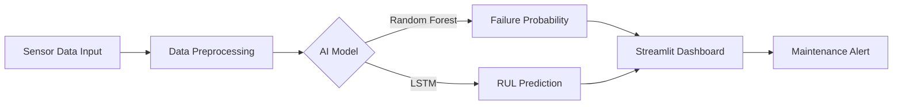

# AI-Powered Predictive Maintenance System 🏭

### 🏆 Capstone Project | Team Exceptional (Group 1)
**Course:** ITAI 2272  
**Authors:** Miguel Mora, Richard Evans, Akinbobola Akinpelu, Olugbenga Adegoroye

---

## 📖 Project Showcase
Unplanned equipment failures cost industrial businesses billions in downtime and repairs. Our solution uses Artificial Intelligence to predict when machines will fail *before* it happens.

**The Goal:**
To build a Predictive Maintenance System that analyzes sensor data from turbofan engines to forecast **Remaining Useful Life (RUL)** and provide early warnings for failures.

### 🛠️ Solution Architecture
We utilize a dual-model approach to ensure reliability and precision:
1.  **Random Forest Classifier**: Predicts binary failure (Will it fail in the next 30 cycles?).
2.  **LSTM Neural Network**: Predicts exact Remaining Useful Life (RUL) in cycles.


---
### 📊 Key Results
* **Latency:** < 100ms (Real-time capable)
* **Business Impact:** Estimated 40% reduction in downtime and 25% cost savings.

## 🎥 Formal Project Presentation
You can view our full project presentation slides here:
[**View AI Model Presentation 2.0**](./AI%20Model%20Presentation%202.0.pptx)

*(Note: Please download the file to view the full PowerPoint)*

---

## 🚀 Live Demonstration
This repository includes a **Live Dashboard** built with Streamlit. This dashboard simulates real-time sensor data ingestion and shows the AI model predicting engine health.

### Installation & Running Instructions

**Prerequisites:**
* Python 3.8+
* Pip (Python package manager)

**Step 1: Clone the Repository**
```bash
git clone [https://github.com/DrahcirSnave/Predictive-Maintenance-Capstone.git](https://github.com/DrahcirSnave/Predictive-Maintenance-Capstone.git)
cd Predictive-Maintenance-Capstone
```
**Step 2: Install Dependencies**
```
pip install -r requirements.txt
```
**Step 3: Rund the Dashboard**
```
streamlit run app.py
```
